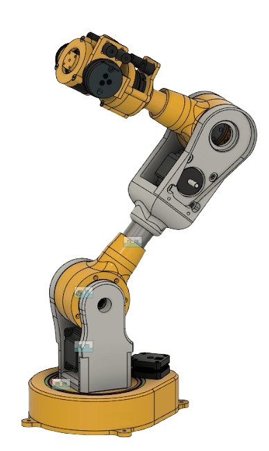

<!-- PROJECT LOGO -->
<br />
<div align="center">
  <a href="https://github.com/atom-robotics-lab/assets/blob/main/logo_1.png?raw=true">
    
  </a>
<h3 align="center">A.J.G.A.R : The Robotic ARM </h3>
</div>

<!-- TABLE OF CONTENTS -->
<details>
  <summary>Table of Contents</summary>
  <ol>
    <li>
      <a href="#about-the-project">About The Project</a>
      <ul>
        <li><a href="#built-with">Built With</a></li>
      </ul>
    </li>
    <li>
      <a href="#getting-started">Getting Started</a>
      <ul>
        <li><a href="#installation ">Installation</a></li>
        <li><a href="#run-simulation">Run Simulation</a></li>
      </ul>
    </li>
    <li><a href="#description">Package Description</a></li>
    <li><a href="#contributing">Contributing</a></li>
    <li><a href="#contacts">Contact</a></li>
    <li><a href="#acknowledgement">Acknowledgments</a></li>
  </ol>
</details>

<!-- ABOUT THE PROJECT -->

## About The Project

<p align="right">

 
This repository is dedicated to the A.J.G.A.R project, which features a 6 Degrees of Freedom (DoF) robotic arm. A.J.G.A.R is designed to autonomously handle objects, utilizing computer vision technology for this purpose. It also supports remote operation via teleoperation.</br></br>
<a href="https://www.youtube.com/watch?v=hW3EiV0Q3Uc"><strong>Demo video </strong></a>
</br>
</p>
 
 ### Built With
[](https://www.sphinx-docs.org) [](https://opencv.org/) [](https://www.blender.org/) [](https://www.raspberrypi.org/) [](https://www.arduino.cc/) [](https://ubuntu.com/) [](https://www.python.org/)

<a href="https://github.com/atom-robotics-lab/robotic-arm-atom/issues/new?labels=bug">Report Bug</a> ·
<a href="https://github.com/atom-robotics-lab/robotic-arm-atom/issues/new?labels=enhancement">Request Feature</a>

<!-- GETTING STARTED -->

## Getting Started

This is an example of how you may give instructions on setting up your project locally.
To get a local copy up and running follow these simple example steps.

There are two ways to execute this project locally: directly on Ubuntu 20.04 or through Docker.

### Installation 
<details> 
<summary><span style="font-size:16px;">Ubuntu 20.04</span></summary>
<ol>

This is an example of how to list things you need to use the software and how to install them.

<li><b>Prerequisites</b> </br>
 Ros 1 Noetic 
  - Refer to our <a href='https://atom-robotics-lab.github.io/wiki/markdown/ros/installation.html'> Ros installation guide </a>

- Installing ROS Controller dependencies
  ```sh
  sudo apt-get install ros-noetic-ros-control ros-noetic-ros-controllers
  ```
- Installing Freenect dependencies
  ```sh
  sudo apt install libfreenect-dev
  sudo apt-get install ros-noetic-rgbd-launch
  ```

* Opencv

  ```sh
  sudo apt install libopencv-dev python3-opencv
  ```

* MoveIt!
  ```sh
  sudo apt install ros-noetic-moveit
  ```

### Installation

1. Create `ROS Workspace` - robotic_arm_ws
   ```sh
   cd ~
   mkdir robotic_arm_ws/src
   ```
2. Clone the repo inside your `Ros Workspace`
   ```sh
   cd ~/robotic_arm_ws/src
   git clone git@github.com:atom-robotics-lab/robotic-arm-atom.git
   ```
3. Build the package
   ```sh
   cd ~/robotic_arm_ws
   catkin_make
   ```
4. Launch the packages file by
   ```sh
   roslaunch <package_name> <launch_file>
   ```


</ol>
</details>

<details> 
<summary><span style="font-size:16px;">Docker</span></summary>
<ol>

### Docker Installation

1. Create `ROS Workspace` - robotic_arm_ws
   ```sh
   cd ~
   mkdir robotic_arm_ws
   ```
2. Clone the repo inside your `Ros Workspace`
   ```sh
   cd ~/robotic_arm_ws/src
   git clone git@github.com:atom-robotics-lab/robotic-arm-atom.git
   ```


1. Install Docker from <a href='https://docs.docker.com/engine/install/ubuntu/'> here </a>

2. Execute the following command to run Docker without using `sudo`

   ```sh
   cd ~/robotic_arm_ws
   sudo usermod -aG docker $USER
   ```

3. The command below will build the Docker image

   ```sh
   ./build_image.sh
   ```

4. Run the image using this command

   ```sh
   ./run_image.sh
   ```

   </ol>
     </details>

### Run Simulation

1. To launch AJGAR model in RViz , Gazebo and MoveGroup :

```sh
roslaunch ajgar_core  ajgar_moveit.launch
```

2. To initialize and start all the services :

```sh
roslaunch ajgar_core ajgar_rosservice.launch
```

3. To start the pick-and-place procedure :

```sh
rosrun ajgar_perception server.py
```


<!-- Package Description -->

## Description

<details> 
<summary>Package Description </summary>
<ol>

| Package | Description |
| --- | --- |
| `ajgar_core` | This package contains the core functionalities of the robotic arm, including the main control algorithms and launch files. |
| `ajgar_depend_pkgs` | This package includes the dependencies required for the freenect_stack (alternative for Kinect camera plugin). |
| `ajgar_description` | This package contains the URDF (Unified Robot Description Format) files for the robotic arm. These files describe the robot's physical configuration. |
| `ajgar_hardware` | This package is responsible for interfacing with the physical hardware of the robotic arm. It includes drivers and communication protocols. |
| `ajgar_moveit_config` | This package contains the configuration files for MoveIt, a ROS-based software for motion planning, kinematics, and robot interaction. |
| `ajgar_perception` | This package is responsible for the perception tasks, such as object recognition and environment mapping. |
| `ajgar_sim` | This package contains the simulation environment for the robotic arm. It includes models and simulation worlds. |
| `ajgar_sim_plugins` | This package contains plugins for the simulation environment, currently providing suction functionality. |
| `ur5_description` | This package contains the URDF files for a specific model of the robotic arm, the UR5. |
| `ur5_moveit_config` | This package contains the MoveIt configuration files for the UR5 robotic arm. |


</ol>
</details>

<!-- CONTRIBUTING -->

## Contributing

Contributions are what make the open source community such an amazing place to learn, inspire, and create. Any contributions you make are **greatly appreciated**.

If you have a suggestion that would make this better, please fork the repo and create a pull request. You can also simply open an issue with the tag "enhancement".
Don't forget to give the project a star! Thanks again!

1. Fork the Project
2. Create your Feature Branch (`git checkout -b feature/AmazingFeature`)
3. Commit your Changes (`git commit -m 'Add some AmazingFeature'`)
4. Push to the Branch (`git push origin feature/AmazingFeature`)
5. Open a Pull Request

For more info refer to [contributing.md](https://github.com/atom-robotics-lab/robotic-arm-atom/blob/main/contributing.md)

<!-- CONTACTS -->

## Contacts

Our Socials - [Linktree](https://linktr.ee/atomlabs) - atom@inventati.org

<!-- ACKNOWLEDGMENTS-->

## Acknowledgement

- [Our wiki](https://atom-robotics-lab.github.io/wiki)
- [ROS Official Documentation](http://wiki.ros.org/Documentation)
- [Opencv Official Documentation](https://docs.opencv.org/4.x/)
- [Rviz Documentation](http://wiki.ros.org/rviz)
- [Gazebo Tutorials](https://classic.gazebosim.org/tutorials)
- [Ubuntu Installation guide](https://ubuntu.com/tutorials/install-ubuntu-desktop#1-overview)
- [Raspberrypi Documentation](https://www.raspberrypi.com/documentation/)
- [MoveIt! Documentation](https://docs.ros.org/en/kinetic/api/moveit_tutorials/html/index.html)
- [Blender Documentaion](https://docs.blender.org/)

<!-- MARKDOWN LINKS & IMAGES -->
<!-- https://www.markdownguide.org/basic-syntax/#reference-style-links -->

[contributors-shield]: https://img.shields.io/github/contributors/atom-robotics-lab/robotic-arm-atom.svg?style=for-the-badge
[contributors-url]: https://github.com/atom-robotics-lab/robotic-arm-atom/graphs/contributors
[forks-shield]: https://img.shields.io/github/forks/atom-robotics-lab/robotic-arm-atom.svg?style=for-the-badge
[forks-url]: https://github.com/atom-robotics-lab/wiki/network/members
[stars-shield]: https://img.shields.io/github/stars/atom-robotics-lab/robotic-arm-atom.svg?style=for-the-badge
[stars-url]: https://github.com/atom-robotics-lab/wiki/stargazers
[issues-shield]: https://img.shields.io/github/issues/atom-robotics-lab/robotic-arm-atom.svg?style=for-the-badge
[issues-url]: https://github.com/atom-robotics-lab/robotic-arm-atom/issues
[linkedin-shield]: https://img.shields.io/badge/-LinkedIn-black.svg?style=for-the-badge&logo=linkedin&colorB=555
